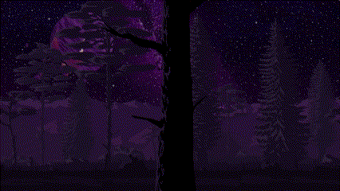
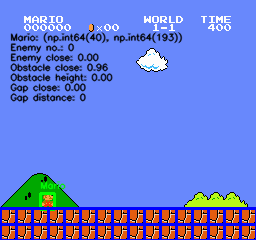

  

---
 

BEng (Software) @ UoN | ML Engineer @ Orica Digital Solutions | Vision & Behaviour @ NUBots

 

---

  <!-- Programming Languages -->
  &nbsp;
  &nbsp;
  &nbsp;
  &nbsp;
  &nbsp;
  &nbsp;
  &nbsp;
  <!-- AI / ML -->
  &nbsp;
  &nbsp;
  <!-- Backend / DevOps -->
  &nbsp;
  <!-- Tools / IDEs -->
  &nbsp;
  &nbsp;
  <!-- Game / 3D / Embedded -->
  &nbsp;
  &nbsp;
  

---

  

    
    

      vectorised sprite detection with an ε-greedy RL policy; first completion after 17 epochs, this gif is 50th (super-mario-bros-gym + openCV)
    

    

    
     
    

 

  

  

---

  

    <!-- Itch.io -->
    &nbsp;&nbsp;&nbsp;
    <!-- LinkedIn (colour PNG) -->
    &nbsp;&nbsp;&nbsp;
    <!-- Discord -->
    &nbsp;&nbsp;&nbsp;
    <!-- Spotify -->
    
  

