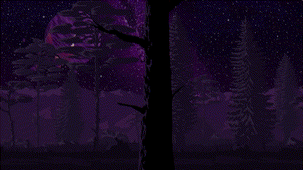
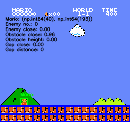

  

---

 

| BEng (Software) Student @ UoN | ML Engineer @ Orica Digital Solutions | Vision & Behaviour @ NUBots | Casual Academic @ UoN |

 

---

  <!-- Programming Languages -->
  &nbsp;
  &nbsp;
  &nbsp;
  &nbsp;
  &nbsp;
  &nbsp;
  &nbsp;
  &nbsp;
  <!-- AI / ML -->
  &nbsp;
  &nbsp;
  &nbsp;
  &nbsp;
  <!-- Backend / DevOps -->
  &nbsp;
  &nbsp;
  <!-- Databases -->
  &nbsp;
  <!-- Tools / IDEs -->
  &nbsp;
  &nbsp;
  <!-- Game / 3D / Embedded -->
  &nbsp;
  &nbsp;
  &nbsp;

---

  

    
    

      vectorised sprite detection with an ε-greedy RL policy; first completion after 17 epochs, this gif is 50th (super-mario-bros-gym + openCV)
    

    

    
     
    

 
  

  
---

  

    &nbsp;&nbsp;&nbsp;
    &nbsp;&nbsp;&nbsp;
    &nbsp;&nbsp;&nbsp;
  

 

