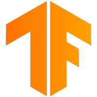

# Hi, I'm Sylforen!

---

## Introduction

Hello! I'm Sylforen, currently pursuing a degree in Software Engineering at the University of Newcastle. I come from a background in Chemistry, having worked for three years as a QC/QC Chemist with occasional R&D projects. From a young age, I’ve always been driven by curiosity—wanting to know how things work, how they work, and what they’re made of. This passion initially led me to pursue a double major in Chemistry and Psychology, but after discovering CRISPR, I swapped Psychology for Biology.

I stepped away from studying chemistry just before the lockdown and took a break from university entirely during the lockdown years. In 2024, I returned to study, starting with Computer Science before switching to Software Engineering.

---

## About Me

Right now, I’m working with Digital Twins and Computer Vision systems—technologies that create virtual replicas of physical systems and help machines “see” and understand the world around them. This job lets me bring together my love for software engineering and robotics by:

- Building and improving virtual models and computer vision tools that make real-world systems smarter  
- Using these tools to simulate and predict how things might behave, which is both challenging and exciting

Alongside that, I’m diving into AI programming and technical design, focusing on making game agents that feel natural and dynamic. Some of what I’m doing includes:

- Creating AI behaviors with behavior trees (BT) and goal-oriented action planning (GOAP) so characters react in believable ways  
- Training machine learning models with convolutional neural networks (CNNs) and deep Q-networks (DQN) to make games that learn and adapt  
- Experimenting with procedural generation for non-linear level design (NLLD-PCG) to keep gameplay fresh and surprising

At the end of the day, I want to work on game systems that keep players engaged by offering new challenges and experiences without getting stuck in repetitive loops.

---

## Tech Stack

**Languages:**  
Python, GDScript, Java, C++, Kotlin  

**Frameworks & Libraries:**  
TensorFlow, PyTorch, Gymnasium, NumPy, Pandas, OpenCV, Matplotlib  

**Game Engines & Tools:**  
Godot, Pygame, Blender  

**Development Tools:**  
Jupyter, VS Code, Git, GitHub  

---

## Technologies I Work With

  
  
  
  
  
  
  
  

---

## GitHub Stats

|  |  |
|:----------------------------------------------:|:------------------------------------------------------------------------------------------------------------:|

---

## Find me on

  
  
  
  
